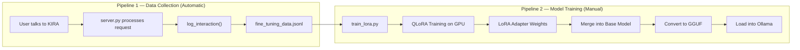
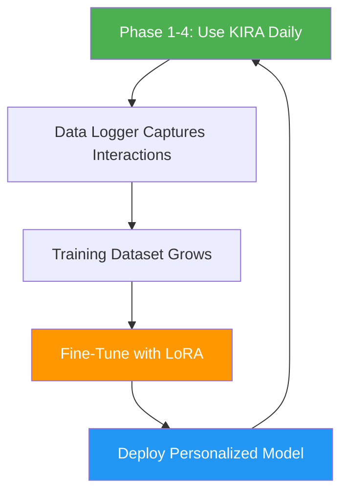

# KIRA — Phase 5: Fine Tuning

> **Objective:** Transform KIRA from a generic AI assistant into a *personalized* one by learning from real user interactions.

---

## 1. What Is Phase 5?

Phase 5 is the **personalization layer** of KIRA. While Phases 1–4 build KIRA's capabilities (voice chat, memory, productivity tools, knowledge search), Phase 5 makes KIRA *yours* — it learns your conversation style, your vocabulary, the tools you use most, and how you phrase things, then adapts the underlying AI model to match.

It achieves this through **LoRA fine-tuning** — a modern, efficient technique for customizing large language models without needing enterprise-grade hardware.

---

## 2. Architecture Overview

Phase 5 has two distinct pipelines:



---

## 3. How It Works — Step by Step

### Step 1: Automatic Data Collection

Every time you interact with KIRA, the conversation is silently logged by the **Dataset Logger** service.

| Component | File | Purpose |
|-----------|------|---------|
| Dataset Logger | `server/services/dataset_logger.py` | Appends each conversation turn to the training dataset |
| Integration Point | `server/server.py` (line 194) | Calls `log_interaction()` after every response |
| Output File | `server/data/fine_tuning_data.jsonl` | The accumulated training dataset |

Each logged interaction follows the **Hugging Face ChatML** format:

```json
{
  "messages": [
    {"role": "system", "content": "You are KIRA, a personal AI voice assistant..."},
    {"role": "user", "content": "schedule gym at 5pm"},
    {"role": "assistant", "content": "TOOL: add_reminder\nARGS: {\"summary\": \"Gym\", ...}\nRESULT: Successfully added Gym to your calendar."}
  ]
}
```

> **Note:** The logger is **thread-safe** (uses `threading.Lock`) and **non-blocking** — if logging fails, KIRA continues working normally. No interaction data is ever lost due to race conditions.

---

### Step 2: LoRA Fine-Tuning

Once enough data is collected, the training script `server/scripts/train_lora.py` is run on a **GPU-enabled environment** (Google Colab recommended).

#### What is LoRA?

**LoRA** (Low-Rank Adaptation) is a parameter-efficient fine-tuning technique. Instead of retraining all ~3.8 billion parameters of Phi-3 Mini, LoRA:

- **Freezes** the original model weights entirely
- **Injects** small trainable adapter matrices into key layers
- Trains only **~0.5–2% of total parameters**

This means you can fine-tune on a **free Google Colab GPU** (T4) instead of needing expensive cloud compute.

#### Training Configuration

| Parameter | Value | Why |
|-----------|-------|-----|
| Base Model | `microsoft/Phi-3-mini-4k-instruct` | Same model KIRA uses via Ollama |
| Quantization | 4-bit (NF4) | Fits in 6GB VRAM via QLoRA |
| LoRA Rank (r) | 16 | Balance between expressiveness and efficiency |
| LoRA Alpha | 32 | Standard 2x multiplier of rank |
| Target Modules | `qkv_proj`, `o_proj`, `gate_up_proj`, `down_proj` | Phi-3's attention + MLP layers |
| Epochs | 3 | Enough to learn patterns without overfitting |
| Batch Size | 2 (×4 grad accumulation) | Effective batch of 8 |
| Learning Rate | 2e-4 with cosine scheduler | Smooth convergence |
| Max Sequence Length | 2048 tokens | Covers full conversation contexts |

---

### Step 3: Model Deployment

After training completes, the fine-tuned model is converted and loaded into Ollama:

```
1. Merge LoRA adapter → Base model (PyTorch)
2. Convert merged model → GGUF format (llama.cpp)
3. Create Ollama model → `ollama create kira -f Modelfile`
4. Update config → Set OLLAMA_MODEL=kira in .env
```

KIRA then automatically uses the personalized model for all future conversations.

---

## 4. Use Cases

### Use Case 1: Tool Selection Learned from Habit

**Before fine-tuning:**
> User: "I need to buy groceries"  
> KIRA: "That sounds like a good plan! What do you need?"

**After fine-tuning (learned from your patterns):**
> User: "I need to buy groceries"  
> KIRA: `TOOL: add_task ARGS: {"summary": "Buy groceries"}` → "Got it, I'll remind you about 'Buy groceries' every 30 seconds until it's done."

KIRA has learned that when *you* say "I need to...", you expect it to **create a task**, not just chat.

---

### Use Case 2: Persona & Tone Matching

**Before fine-tuning (generic):**
> User: "what do u know about me?"  
> KIRA: "As an AI language model, I don't have access to personal information..."

**After fine-tuning (personalized):**
> User: "what do u know about me?"  
> KIRA: "I don't have personal info on individuals unless shared with me during our chats! Your privacy is important. So far, we've just had a brief exchange!"

The fine-tuned model learns to respond in **KIRA's casual, friendly persona** rather than a generic AI tone.

---

### Use Case 3: Query Routing

**Before fine-tuning:**
> User: "find rust tutorials"  
> KIRA: "I can help with that! Rust is a systems programming language..."

**After fine-tuning (learned from Phase 4 data):**
> User: "find rust tutorials"  
> KIRA: `TOOL: search_github ARGS: {"query": "Rust tutorials", "language": "rust"}`

The model learns that code/tutorial queries should be routed to **GitHub search**, while general knowledge queries go to **Google search**.

---

### Use Case 4: Scheduling Shortcuts

From the training data, KIRA learns your scheduling habits:

> User: "gym at 5:30"  
> KIRA: Automatically infers today's date, sets 90-minute duration (your default), and creates the calendar event — no follow-up questions needed.

---

## 5. Technology Stack

| Technology | Role |
|------------|------|
| **Phi-3 Mini (3.8B)** | Base language model |
| **QLoRA / PEFT** | Parameter-efficient fine-tuning |
| **Hugging Face TRL** | SFTTrainer for supervised fine-tuning |
| **BitsAndBytes** | 4-bit quantization for memory efficiency |
| **llama.cpp** | GGUF conversion for Ollama compatibility |
| **Ollama** | Local model serving for KIRA |

---

## 6. Current Dataset Statistics

| Metric | Value |
|--------|-------|
| Total logged interactions | **24 samples** |
| Dataset file | `server/data/fine_tuning_data.jsonl` (15.6 KB) |
| Interaction types captured | Chat, task management, scheduling, web search, GitHub search |

> **Tip:** For effective fine-tuning, aim for **200–500+ samples** covering diverse interaction types. Continue using KIRA across all phases to grow this dataset organically.

---

## 7. Summary

Phase 5 closes the feedback loop in KIRA's architecture — usage data from Phases 1–4 flows back into the model itself, creating a system that **gets better the more you use it**. The combination of automatic data collection and efficient LoRA training makes this achievable on consumer hardware, keeping KIRA fully local and private.


